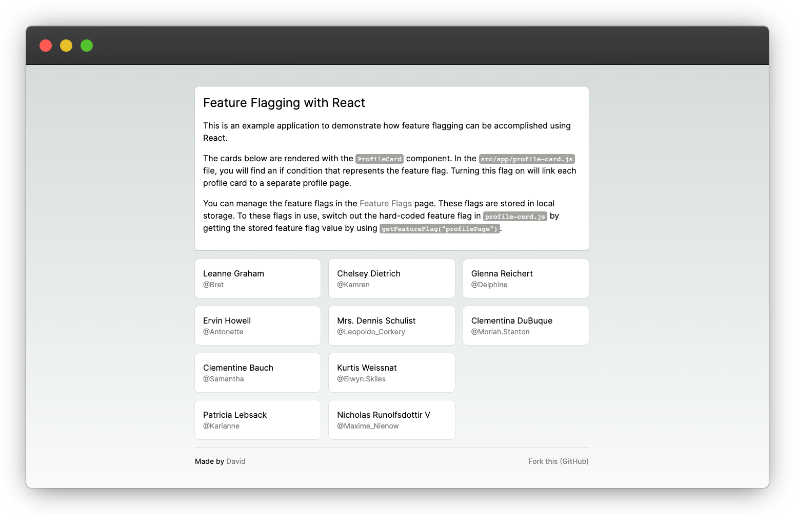

# Feature Flags in React

This is a simple example repository to show how Feature Flags can be used in React.



## Getting Started

Running the app:

```shell
yarn install
yarn dev
```

Then open [http://localhost:3000](http://localhost:3000).
